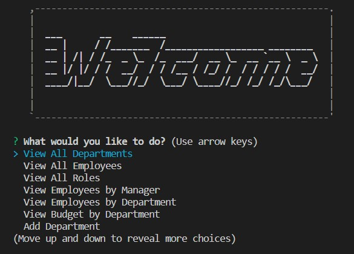
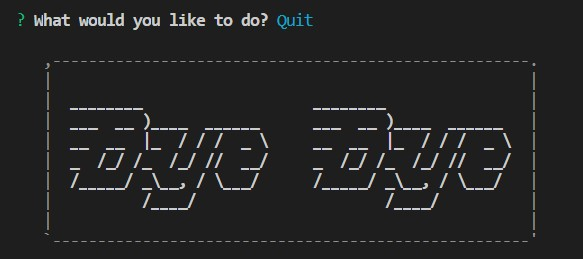
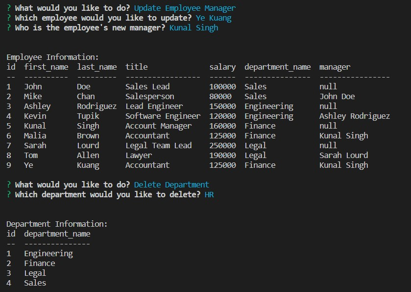

[](https://opensource.org/licenses/MIT)
  
  # Employee Tracker
  
  ## Project Description
  Create a command-line application to manage a company's employee database

  ## Table of Content

  * [Preview](#preview)

  * [Installation](#installation)

  * [Usage](#usage)

  * [License](#license)

  * [Contributing](#contributing)

  * [Question](#question)

  ## Preview
  [*Demo Video*](https://app.castify.com/view/4bfd6ae0-abce-4015-ba33-13112f8abf40)


  *Start Page:*

  


  *End Page:*
  
  


  *Operating:*

  

  ## Installation
  To install the necessary dependencies, run the following commands:
  
  ```
  npm install
  npm i inquirer@8.2.4
  npm i mysql2
  npm i asciiart-logo
  npm i console.table
  ```
  
  ## Usage
  After clone the repository to local machine and install the necessary dependencies, change the password to your SQL password and then run below command in terminal to start the application:
  ```
  node index
  ```

  ## License
  This project is licensed under the 

  [](https://opensource.org/licenses/MIT)
  
  ## Contributing
  N/A
    
  ## Question
  * Connect me on [Github](https://github.com/ykuang321)
  * For any additional questions/information, contact me by Email: **kuangye869@gmail.com**
